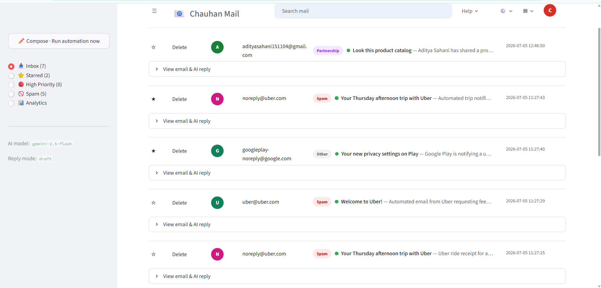
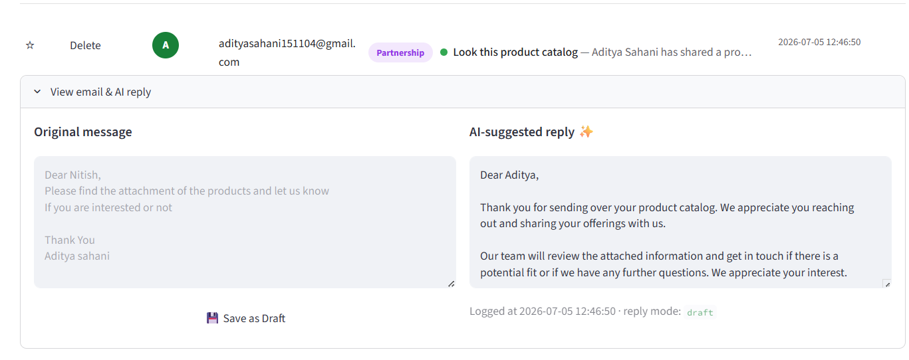
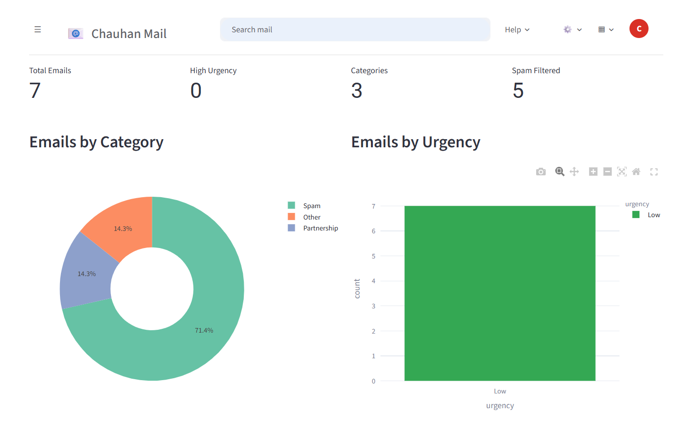
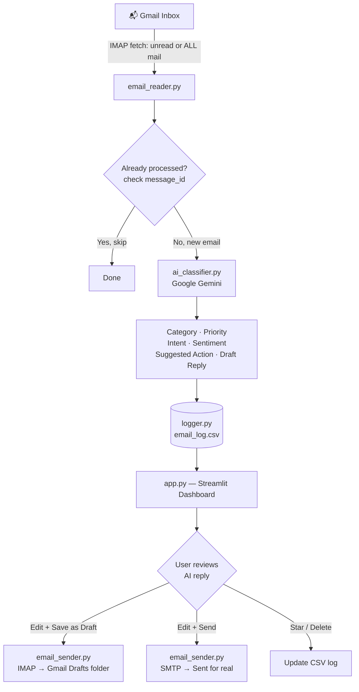

<div align="center">

# 📧 AI Email Automation System

### ScaleOn Internship Program 2026 — Assignment 01 (AI Agent Developer Track)
**Option Selected: AI Automation Challenge → Email Automation**

An AI-powered agent that reads your Gmail inbox, classifies every email (category, priority, intent, sentiment), drafts a context-aware reply using Google Gemini, and lets you review, edit, save-as-draft, or send it — all from a Gmail-styled dashboard.

[](https://www.python.org/)
[](https://streamlit.io/)
[](https://ai.google.dev/)
[](LICENSE)
[]()

[🎥 Demo Video](https://colab.research.google.com/drive/1BaZlow1SPpu4tUo1LoeL7LycyDhh5tR8?usp=sharing) · [🐛 Report Bug](https://github.com/nitishchauhan002/AI-Email-Automation-System/issues) · [💡 Request Feature](https://github.com/nitishchauhan002/AI-Email-Automation-System/issues)

</div>

---

## 📌 Problem Statement

Businesses receive a constant stream of repetitive inbound emails — pricing questions, demo requests, support tickets, HR queries, promotional spam — and manually reading, categorizing, and replying to each one wastes hours every week.

This project automates that entire first-response workflow using AI, so a human only needs to **review and approve** rather than read-and-write everything from scratch.

## ✨ Features

| Feature | Description |
|---|---|
| 📥 **Full Inbox Fetch** | Pulls **every email** in the inbox (read + unread), not just unread ones |
| ⚡ **Unread-Only Mode** | Faster option to just check new mail |
| 🧠 **AI Classification** | Category (Sales / Support / HR / Finance / Marketing / Meeting / Orders / Spam), Priority, Intent, Sentiment |
| ✍️ **AI-Drafted Replies** | Gemini writes a professional reply tailored to each email's intent |
| 📤 **Send Reply** | Edit the AI draft and send it for real, directly from the dashboard |
| 💾 **Save as Draft** | Push the reply into your real Gmail Drafts folder instead of sending |
| 🔍 **Live Search** | Filter by sender, subject, intent, category, or body content |
| ⭐ **Star / 🗑️ Delete** | Organize and clean up processed emails |
| 📊 **Analytics Dashboard** | Category breakdown, priority distribution, spam-filtered count |
| 🚫 **Duplicate-safe** | Tracks `message_id` so re-running never reprocesses the same email twice |
| 🎨 **Gmail-style UI** | Familiar inbox layout — avatars, labels, priority dots, hamburger menu |

## 🖼️ Screenshots

> _Replace these placeholders with your own screenshots — drop the image files into a `screenshots/` folder in the repo and update the paths below._

| Inbox View | AI Reply + Draft/Send | Analytics |
|---|---|---|
|  |  |  |

## 🧭 How It Works



## 🏗️ Tech Stack

- **Frontend/Dashboard:** Streamlit + Plotly (Gmail-inspired custom CSS)
- **AI Engine:** Google Gemini API (`gemini-2.5-flash`, free tier — no card required)
- **Email Protocols:** IMAP (fetch + draft) / SMTP (send) via Python's `imaplib` / `smtplib`
- **Storage:** CSV-based lightweight log (`email_log.csv`) — easy to inspect in Excel/Sheets
- **Language:** Python 3.10+

## 📂 Project Structure
email-automation/
├── app.py              # Streamlit dashboard (UI + all user interactions)
├── main.py              # Automation entry point: fetch → classify → log
├── ai_classifier.py       # Gemini-powered classification + reply generation
├── email_reader.py         # IMAP: fetch unread / all mail, parse HTML→text
├── email_sender.py          # IMAP/SMTP: save draft or send reply
├── logger.py                 # CSV read/write, duplicate detection, delete
├── config.py                  # Loads settings from .env
├── requirements.txt
├── .env.example                # Template — copy to .env and fill in your keys
└── README.md

## 🚀 Getting Started

### 1. Clone the repo
```bash
git clone https://github.com/nitishchauhan002/AI-Email-Automation-System.git
cd AI-Email-Automation-System
```

### 2. Create a virtual environment
```bash
python -m venv venv
venv\Scripts\activate       # Windows
source venv/bin/activate    # Mac/Linux
```

### 3. Install dependencies
```bash
pip install -r requirements.txt
```

### 4. Configure environment variables
Copy `.env.example` → `.env` and fill in:

```env
EMAIL_ADDRESS=youremail@gmail.com
EMAIL_PASSWORD=your_gmail_app_password
GEMINI_API_KEY=your_gemini_api_key
GEMINI_MODEL=gemini-2.5-flash
REPLY_MODE=draft
```

- **Gmail App Password:** Google Account → Security → 2-Step Verification → App Passwords
- **Gemini API Key (free):** https://aistudio.google.com/apikey

### 5. Run the dashboard
```bash
streamlit run app.py
```
Opens at **http://localhost:8501**

## 🖱️ Usage

1. Click **📬 Fetch ALL mail** (or **⚡ Check unread only** for speed) in the sidebar.
2. The AI classifies every new email and shows it in a Gmail-style inbox row.
3. Click **View email & AI reply** to expand any email.
4. Edit the AI-suggested reply if needed.
5. Click **📤 Send** to actually send it, or **💾 Save as Draft** to review later in Gmail.
6. Use the search bar, star, delete, and Analytics tab to manage the inbox.

## 🎥 Video Walkthrough

📺 **[Watch the demo video here](https://colab.research.google.com/drive/1BaZlow1SPpu4tUo1LoeL7LycyDhh5tR8?usp=sharing)**

Covers: the problem selected, approach, live demo, tools used, what I learned, and future improvements.

## 🔮 Future Improvements

- Replace CSV storage with SQLite/PostgreSQL for larger volumes
- Slack/WhatsApp notification for high-priority emails
- Full Google OAuth2 login (currently uses Gmail App Password for simplicity)
- Deploy publicly (Streamlit Community Cloud / Render) for a live shareable link
- Multi-account support

## 👤 Author

**Nitish Kumar Singh (Chauhan)**
🔗 [LinkedIn](https://www.linkedin.com/in/nitish-kumar-singh-4802792bb/) · [GitHub](https://github.com/nitishchauhan002)

---

<div align="center">
Built for the <b>ScaleOn Internship Program 2026 — AI Automation Challenge</b>
</div>